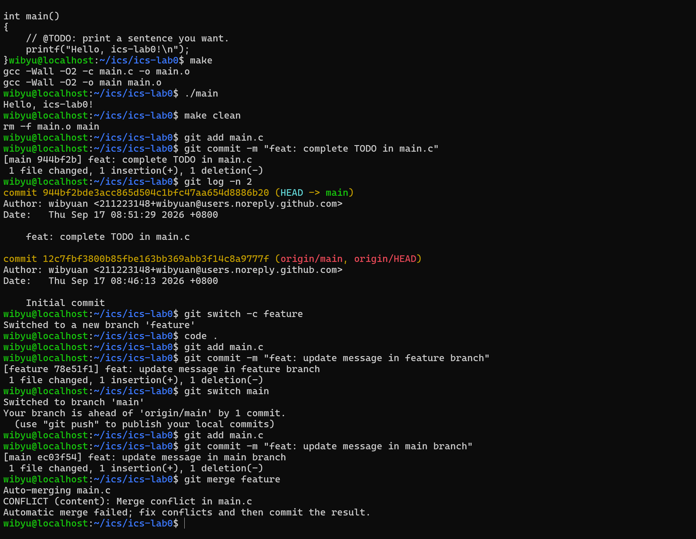
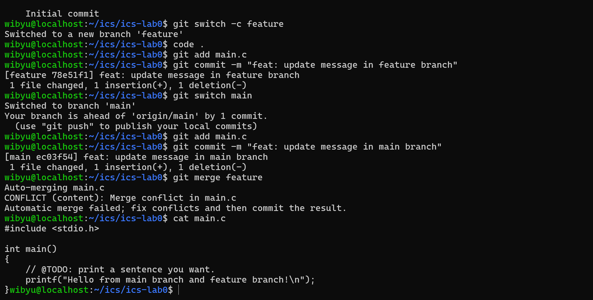
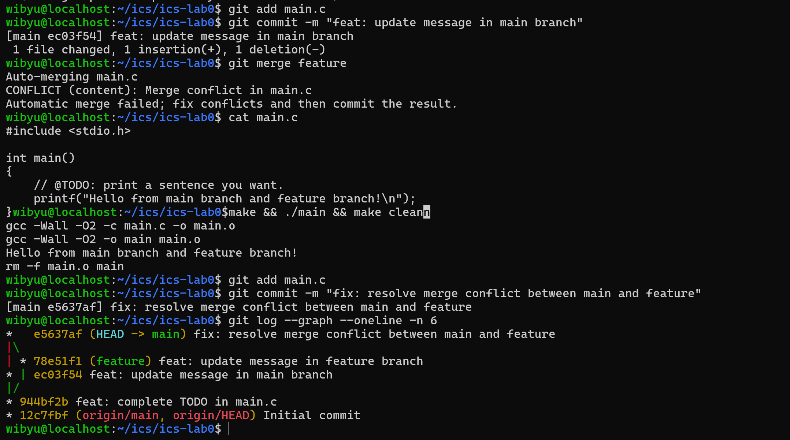

# 思考题回答

## 多人协同开发经历与协作方式

我之前在大作业中有多人协作的经历，我们采用 github 进行版本管理，团队采用主分支保护+特性分支开发+pull request 审查的协作模式，每个人不在 main 分支上直接提交代码，而是从最新的 dev 分支中切出自己的功能分支，完成后通过本地测试后发起 pull request，由同组成员进行 Code Review 并确认无冲突后再合并，这种模式有效避免了代码相互覆盖的问题。

## Git 为什么要设计暂存-提交这个步骤

Git 引入暂存区作为工作区和本地版本库之间的缓冲存，因为：
1. 实现原子性提交，工作区中可能会进行多项修改
2. 安全缓冲与审查机制：暂存区给开发者提供了核对变更的机会（如使用 `git diff --staged` 查看即将提交的具体差异，或用 `git restore --staged` 撤回误添加的文件），防止将临时调试代码、密钥或编译生成物误提交至历史记录中。
3. 更清晰地处理冲突：在合并冲突解决过程中，开发者可以逐个将解决好的文件添加到暂存区，标记解决进度，使得复杂合并流程更具条理与可控性。

##  `git branch` 和 `git branch -a` 的区别
- **`git branch`**：仅列出当前本地仓库（Local Repository）中已存在的本地分支，当前所在分支前会带有 `*` 标识。
- **`git branch -a`**（`-a` 即 `--all`）：列出所有分支，既包括本地分支，也包括本地跟踪的远程分支（Remote-Tracking Branches，通常以 `remotes/origin/...` 前缀显示）。它能让开发者全面了解本地与远程仓库的分支对应状态。

---

# 拓展阅读概括与心得（TODO 3）

## 阅读材料概括（三选二）

### （1）《Commit Message 规范》概括
文章介绍了业界主流的 AngularJS 提交规范，将 Git 提交信息结构化为 **Header**（格式为 `<type>(<scope>): <subject>`）、**Body**（详细说明修改背景与逻辑）和 **Footer**（记录破坏性变更或关联 Issue）。规范划分了明确的提交类型（如 `feat` 新增功能、`fix` 修复缺陷、`docs` 文档变更、`refactor` 重构等）。遵循该规范能使版本历史具备极高的可读性，大幅降低团队协作沟通成本，并为自动化生成 CHANGELOG 及版本发布提供可能。

### （2）《Git Flow 分支控制》概括
Git Flow 是一种成熟、严谨的工程化分支模型。模型定义了两条长期分支：`master/main`（始终保持生产环境稳定就绪状态）和 `develop`（汇总日常开发成果的主线分支）；以及三种短期辅助分支：`feature`（新功能开发）、`release`（新版本发布前的测试修补）和 `hotfix`（生产环境突发紧急缺陷修复）。该模型规范了分支的生命周期与合并流向，确保团队在多人并行开发时代码交付有序演进。

##  对“为什么要学习 Git”的理解
1. **防止灾难与安全试错**：Git 的本质是文件快照系统。无论是逻辑写崩还是误删文件，都能依靠历史 commit 和 `git reflog` 快速安全回溯，给予开发者极大的重构与探索自由。
2. **支持多人异步高频协作**：通过轻量级分支隔离与冲突合并机制，团队各成员无需相互阻塞等待，即可并行开发各自模块，极大提升了软件工程的交付效率。
3. **工程化与规范化基础**：现代软件开发中的 CI/CD 持续集成、代码审查（Code Review）、自动化测试均与 Git 生态深度绑定，掌握 Git 是迈入规范化软件研发的必备基础素养。

---

# 三、实验步骤与分支冲突解决（TODO 2 & 4）

## 1. 模板建仓与 main.c 修改
- 根据课程模板创建独立仓库 `ics-lab0`，并在本地 WSL 原生路径下执行 `git clone`。
- 修改 `main.c` 中的 TODO 内容，使用 `make` 编译并运行验证通过，使用 `git commit -m "feat: complete TODO in main.c"` 完成首次提交。

## 2. 分支创建与冲突制造
- 新建并切换至 `feature` 分支：`git switch -c feature`。修改 `main.c` 第 6 行打印语句并提交。
- 切换回 `main` 分支：`git switch main`。同样修改 `main.c` 第 6 行打印语句为不同内容并提交。
- 在 `main` 分支上执行 `git merge feature`，由于两个分支在同一文件的同一位置引入了不同改动，成功触发合并冲突：

```text
Auto-merging main.c
CONFLICT (content): Merge conflict in main.c
Automatic merge failed; fix conflicts and then commit the result.
```

**【截图 1：遇到合并冲突】**  

## 3. 冲突解决与验证
- 打开 `main.c`，手动剔除 Git 插入的 `<<<<<<<`、`=======`、`>>>>>>>` 冲突标记，整合代码保留预期的输出内容。
- 在终端查看修改后的代码内容，确认冲突符号已全部清除：

**【截图 2：消除冲突标记后的代码】**  


- 重新运行 `make && ./main && make clean` 验证编译执行正常。
- 执行 `git add main.c` 并提交合并 `git commit -m "fix: resolve merge conflict between main and feature"`。
- 执行 `git log --graph --oneline -n 6` 查看分支拓扑图，确认两分支已成功合并汇聚：

**【截图 3：分支合并拓扑图谱】**  

